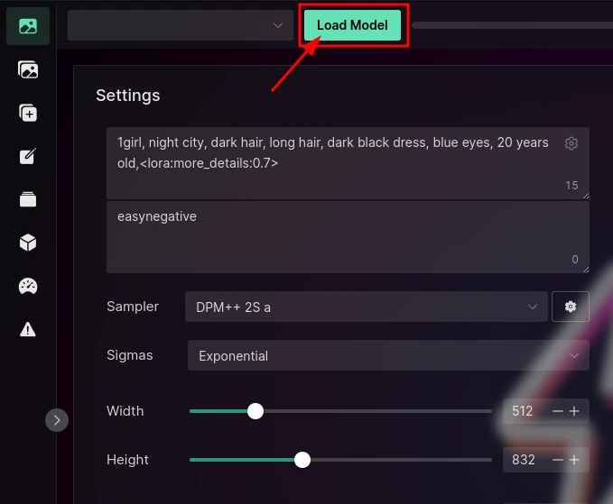
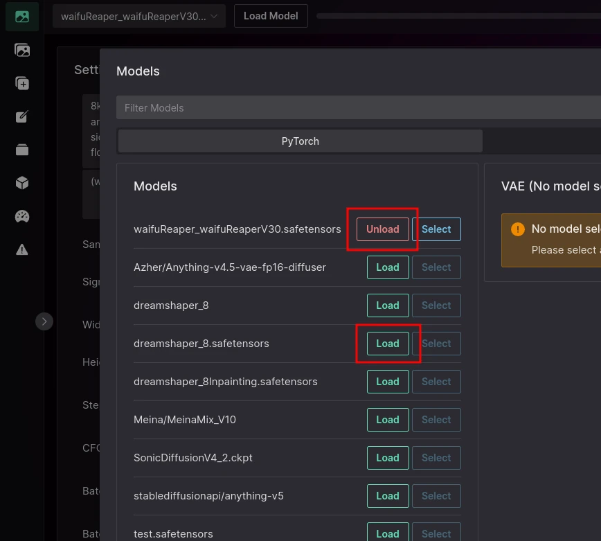

# Models

Models are what is responsible for the main aesthetics of the output image. They come in two main formats

- Checkpoint files (`.ckpt` or `.safetensors`)
- Diffusers

Both of these formats are supported by the UI, but **Diffusers is the preffered way**.

Checkpoints are the raw files that you can download from sites like [CivitAI](https://civit.ai/) or from `Models -> CivitAI` tab.

Diffusers is unwrapped format that stores all the parts of the model separately. This allows for a more modular approach to loading the models, where you can just load the parts you need. You can browse these models on [HuggingFace](https://huggingface.co/).

| Feature           | Checkpoints | Diffusers |
| ----------------- | ----------- | --------- |
| Load speed        | Slow        | Fast      |
| Ease of transport | Easy        | Hard      |
| AITemplate        | No          | Yes       |
| Supported         | Yes         | Yes       |
| Recommended       | No          | Yes       |

## Where to put the files

Volta will look for files ending with `.ckpt` or `.safetensors` in the `data/models` folder.

If you have model in the **Diffusers format**, you can just drop the folder into the `data/models` folder.

::: warning
Diffusers model might not show up in the UI if Volta considers it to be invalid. You can see more info if you run Volta from the terminal with the `LOG_LEVEL=DEBUG` mode, which can be set in the `.env` file.
:::

## Diffusers model download

- Easy Download and Install within the UI

::: warning
Moving files into the `data/models` will require a reconnect of the UI to the server. This can be done by clicking the `Reconnect` button in the top right corner of the UI.
:::

1. Custom Model Download - Paste the ID of the model you want to download there and click Install
2. Currated Model Download - Click on the Download button and wait for the download to finish

::: tip
Download progress can be seen in the terminal window where you started Volta.
:::

## Checkpoints download/install

- Uploading models via the Model Manager
- Manually dropping the files into the `data/models` folder

::: warning
Moving files into the `data/models` will require a reconnect of the UI to the server. This can be done by clicking the `Reconnect` button in the top right corner of the UI.
:::

These models will then be available to load in the UI.

::: info
The first time you try to load a checkpoint model, Volta will download the necessary files to run the model. This can take a while, but only needs to be done once.
:::

## Model Manager

This tab in the UI is the place where you can manage your models. It's main purpose for now is model deletion and easy model upload.

- ✅ Feature available and supported
- ❌ Feature not available yet
- 🚧 Feature is in the development or testing phase

| Feature              | Supported |
| -------------------- | --------- |
| Easy File uppload    | ✅        |
| Deletion             | ✅        |
| One Click conversion | ❌        |
| VAE swapping         | ❌        |

## Loading models

All the models should become available to load in the Model Loader:

Click on the **Load Model** button:

Select the model you just downloaded:

1. Click the Load Button (marked as 1)
2. Wait for the button to change to Unload (marked as 2)

## Extra

### VAE swapping

VAE swapping can be done in the Model Loader. This allows you to use the VAE from another model.
